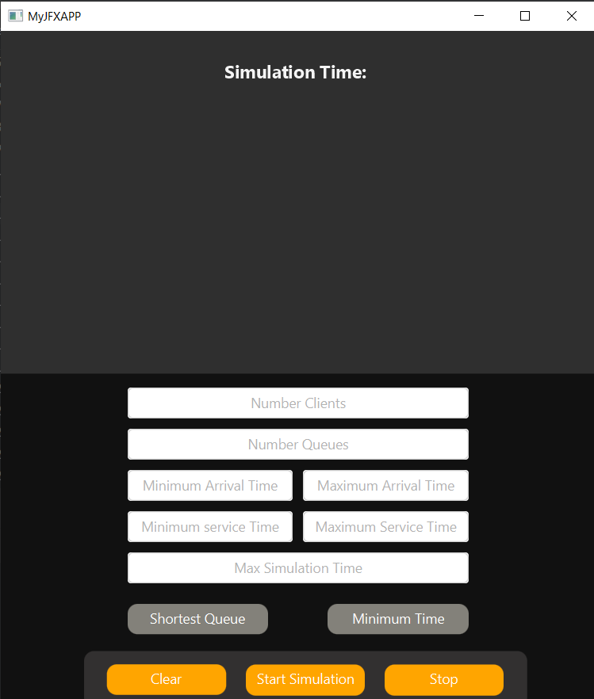
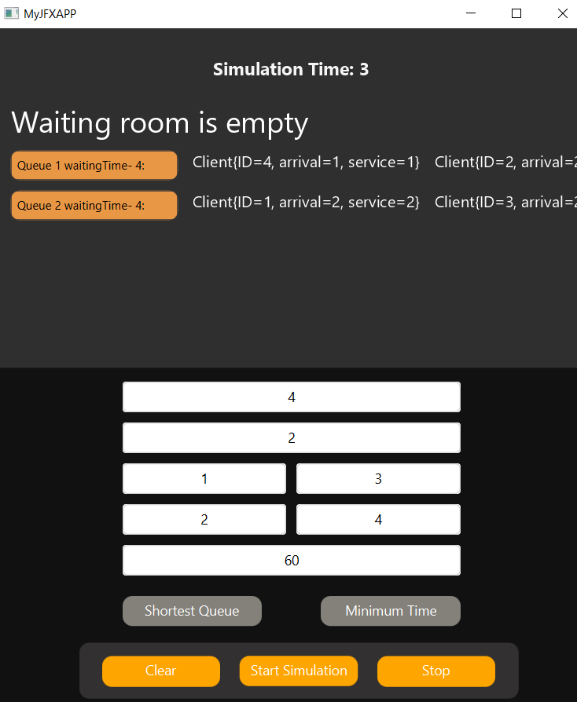
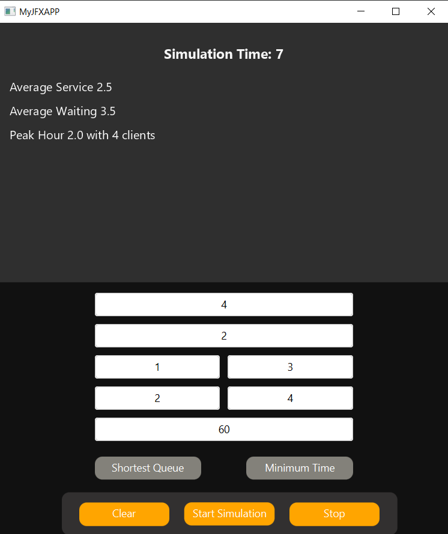

# Queue Simulation System

## Overview
The **Queue Simulation System** is a JavaFX application that simulates a queue-based system where **clients arrive, wait in queues, get served, and leave**. The system calculates **average waiting time, service time, and peak hour** while allowing users to select different queuing strategies.

## Application Screenshot
Below is an image of the Queue Simulation System:



In Action: 



Results:



## Features
- **Real-time queue visualization**
- **Dynamic client distribution strategies**:
  - Shortest Time Strategy
  - Shortest Queue Strategy
- **User-defined simulation parameters**
- **Statistical calculations**:
  - Average waiting time
  - Average service time
  - Peak hour analysis
- **Simulation controls**:
  - Start/Stop simulation
  - Clear inputs for a new simulation
- **Log generation** for simulation results

## Technologies Used
- **Java (JavaFX)** for GUI
- **FXML** for UI layout
- **CSS** for styling
- **Concurrency & Thread Management**
- **File Writing for Logs**

## File Structure
```
QueueSimulation/
│── src/
│   ├── AppLogic/                # Core logic for the simulation
│   │   ├── Client.java          # Represents a client (arrival & service time)
│   │   ├── Server.java          # Represents a queue where clients are served
│   │   ├── Scheduler.java       # Distributes clients to servers
│   │   ├── SimulationManager.java # Controls the simulation flow
│   │   ├── Strategy.java        # Defines queue distribution strategies
│   │   ├── StrategyPicked.java  # Enum for strategy selection
│   ├── Controllers/             # JavaFX GUI management
│   │   ├── GUI.java             # Controls the graphical interface
│── resources/
│   ├── GUI.fxml                 # JavaFX UI Layout
│   ├── style.css                # UI Styling
│── docs/
│   ├── Craciunas_Victor_Documentation.pdf  # Project documentation
```

## Installation & Running the Application
### 1. Clone the Repository
```
git clone https://github.com/yourusername/Queue-Management.git
```

### 2. Run the Application
- Open the project in **IntelliJ IDEA** (or another Java IDE)
- Ensure JavaFX is configured correctly
- Run the app using maven

## How It Works
### **Simulation Setup**
1. The user enters the following parameters:
   - Number of clients
   - Number of queues
   - Simulation interval
   - Min/Max arrival time
   - Min/Max service time
2. The application validates input and displays a **Start Simulation** button.

### **Running the Simulation**
- The system dynamically assigns clients to queues based on the selected **strategy**.
- The GUI updates in **real-time** to show the queues evolving.
- **Statistics (waiting time, service time, peak hour) are displayed** at the end.

### **Stopping & Resetting**
- Users can **stop the simulation** and clear the data.
- The system allows for **new simulations** with different parameters.

## Simulation Strategies
- **Shortest Time Strategy:** Clients are placed in the queue with the **lowest total service time**.
- **Shortest Queue Strategy:** Clients are placed in the queue with the **fewest waiting clients**.

## Example Usage (GUI Interaction)
1. Enter simulation parameters in the input fields.
2. Click **Start Simulation**.
3. Watch real-time updates of clients moving through queues.
4. View **statistics** at the end of the simulation.
5. Stop or restart the simulation if needed.

## Results & Statistics
- The system records:
  - **Average service time**
  - **Average waiting time**
  - **Peak hour** (when the highest number of clients were in queues)
- The simulation **writes logs** to `simulation_output.txt`.

## Future Improvements
- **Graphical representation of statistics** (charts & graphs)
- **More queuing algorithms**
- **User input validation improvements**


